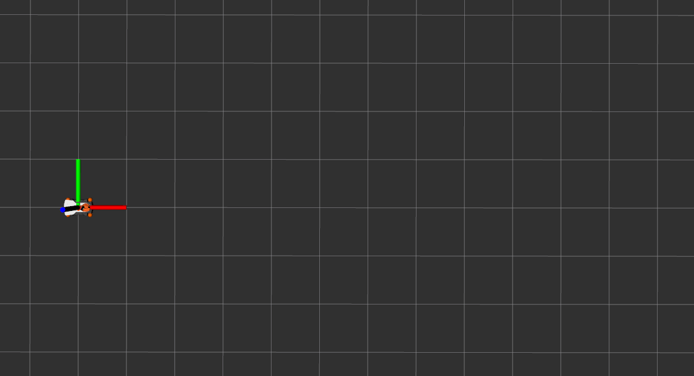

# :fire: Project 2

The goal was to make the robot follow a sequence of points (follow a path).


## idea:

- for each point in the path, make the robot go to the point using same method in [project 1](https://github.com/hasauino/project_1).
- before the robot reaches the current point, switch to the next point.
- Keep doing this until the path is done


## How to run this sample solution


- call this launch file:

  ```bash
  roslaunch project_2 all.launch
  ```

  this launch file will bring up Gazebo, Rviz, and the action server node.

  :bulb: the launch file loads Rviz with a configuration file that shows odometry topic. It shows the actual robot path.

- to send a path, you can run the example client script (sends a sinusoidal path):

  ```
  rosrun project_2 client_example_sinusoidal.py
  ```





**Note**

- `rviz.launch` file is just like `all.launch` but without Gazebo GUI.
- `gazebo.launch` file is just like `all.launch` but without Rviz.
